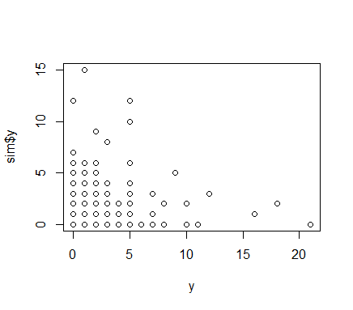
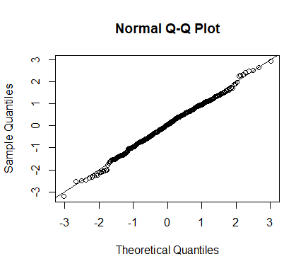
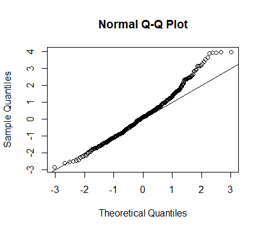

```{r setup, include=FALSE}
knitr::opts_chunk$set(echo = TRUE)
```
### Summary

The goal of this example is to demonstrate how to incorporate key TMB functionalities into a modular C++ framework. The ar1xar1 .R and .cpp code from [TMB examples](https://github.com/kaskr/adcomp/tree/master/TMB/inst/examples) were modified to demonstrate the following TMB functions in a modular framework:

- [SIMULATE](https://kaskr.github.io/adcomp/group__macros.html#ga6c7c2eba6072ba55386fe72bc49604e2)
- [SEPARABLE](https://kaskr.github.io/adcomp/classdensity_1_1SEPARABLE__t.html)
- [DATA_VECTOR_INDICATOR](https://kaskr.github.io/adcomp/group__macros.html#ga572dab4f17d676ac36bc8e92f3c9a4c0) (for model validation)

### File Structure Overview

The [ar1xar1 modular example](https://github.com/Andrea-Havron-NOAA/FIMS-software/tree/master/src/Rcpp/ar1xar1) uses the following file structure:

1. [Common.hpp](https://github.com/Andrea-Havron-NOAA/FIMS-software/tree/master/src/Rcpp/ar1xar1/Common.hpp)
  - Includes all header statements
    - #include <TMB.hpp>: includes TMB core files
    - using namespace density: includes functions from TMB's density.hpp (AR1, SEPARABLE)

  - Defines model_traits structure

2. [model.hpp](https://github.com/Andrea-Havron-NOAA/FIMS-software/tree/master/src/Rcpp/ar1xar1/model.hpp): Sets up ar1xar1 C++ templated class 
  
  - Line 15 public: defines input data and parameters using the model_traits struct
  - Lines 31-33: set up C++ singleton class. This singleton class will allow the functions within to be called within the TMB objective_function
  - Lines 36-45: model is defined within the evaluate function
  
3. [ar1xar1.cpp](https://github.com/Andrea-Havron-NOAA/FIMS-software/tree/master/src/Rcpp/ar1xar1/ar1xar1.cpp): TMB interface with model.hpp
  
  - Line 2: include model.hpp
  - Line 10: set-up TMB objective_function
  - Line 13: create a pointer, inst, to point to the singleton class of ar1xar1 
  - Lines 15-21: set-up data and parameters using TMB macros
  - Lines 23-27: Define public members of ar1xar1 class
  - Line 29: Call the evaluate function
  - Lines 31-37: Simulate data and random effects using the TMB SIMULATE function
  - Lines 39-42: Report out derived values and their standard errors

4. [ar1xar1.R](https://github.com/Andrea-Havron-NOAA/FIMS-software/tree/master/src/Rcpp/ar1xar1/ar1xar1.R): I/O R Interface

  - Line 4: compiles ar1xar1.cpp
  - Lines 6-31: Simulate data
  - Lines 37-52: Fit model and generate reports
  - Lines 54-58: Simulate data from model and compare to original data
  - Lines 60-68: Model validation
  - Lines 70-100: Repeat steps for mis-specified model
  
### Incorporating TMB functions into modular framework

#### 1. SIMULATE
 The SIMULATE function is run in the TMB interface, [ar1xar1.cpp](https://github.com/Andrea-Havron-NOAA/FIMS-software/blob/334ccc9e1b6ee99e80260e7555a721b9d8e7cfe1/src/Rcpp/ar1xar1/ar1xar1.cpp#L31). Simulations are implemented as they would be for a standalone TMB model. For detailed examples, see the [comprehensive TMB documentation](https://kaskr.github.io/adcomp/_book/Simulation.html#simulation-blocks). If simulations require derived mean values, functions within the singleton class can be called within the SIMULATE function to calculate the mean. See [logisticGrowth.cpp](https://github.com/Andrea-Havron-NOAA/FIMS-software/blob/68b0c838d2e35012bd0fa85371072f7fdf6d2c93/src/Rcpp/logisticGrowth.cpp#L34) for an example. Note that simulation blocks are not commutative, therefore care must be taken to place random effects and data in their proper order.

Data can be simulated from the model from the [R interface](https://github.com/Andrea-Havron-NOAA/FIMS-software/blob/334ccc9e1b6ee99e80260e7555a721b9d8e7cfe1/src/Rcpp/ar1xar1/ar1xar1.R#L54):
```{r, eval = FALSE}
## Not run
sim <- obj$simulate()
plot(y, sim$y)
```


#### 2. SEPARABLE
Functions within density.hpp, including AR1 and SEPARABLE, are accessible to the ar1xar1 class after adding the following to [Common.hpp](https://github.com/Andrea-Havron-NOAA/FIMS-software/blob/334ccc9e1b6ee99e80260e7555a721b9d8e7cfe1/src/Rcpp/ar1xar1/Common.hpp#L10):

```{r, eval = FALSE}
## Not run
using namespace density;
```

The SEPARABLE fuction requires the random effect vector be of a PARAMETER_ARRAY type. The following code is used to declare the parameter type for the random effect vector, eta, within the public section of [model.hpp](https://github.com/Andrea-Havron-NOAA/FIMS-software/blob/334ccc9e1b6ee99e80260e7555a721b9d8e7cfe1/src/Rcpp/ar1xar1/model.hpp#L21):

```{r, eval = FALSE}
## Not run 
tmbutils::array<Type> eta;
```

The SEPARABLE function is run within the evaluate function of [model.hpp](https://github.com/Andrea-Havron-NOAA/FIMS-software/blob/334ccc9e1b6ee99e80260e7555a721b9d8e7cfe1/src/Rcpp/ar1xar1/model.hpp#L39).

#### 3. DATA_VECTOR_INDICATOR
TMB uses this MACRO as part of its model validation capabilities for random effects models. For an overview, see the [comprehensive TMB documentation](https://kaskr.github.io/adcomp/_book/Validation.html).

The DATA_VECTOR_INDICATOR, keep, is defined in the [ar1xar1.cpp](https://github.com/Andrea-Havron-NOAA/FIMS-software/blob/334ccc9e1b6ee99e80260e7555a721b9d8e7cfe1/src/Rcpp/ar1xar1/ar1xar1.cpp#L16) file as it would in a standalone TMB script. This vector is then used as the definition of the keep vector defined in the public section of [model.hpp](https://github.com/Andrea-Havron-NOAA/FIMS-software/blob/334ccc9e1b6ee99e80260e7555a721b9d8e7cfe1/src/Rcpp/ar1xar1/model.hpp#L18) and linked through the [inst pointer](https://github.com/Andrea-Havron-NOAA/FIMS-software/blob/334ccc9e1b6ee99e80260e7555a721b9d8e7cfe1/src/Rcpp/ar1xar1/ar1xar1.cpp#L24).

```{r, eval = FALSE}
//model.hpp

public:
  data_indicator<tmbutils::vector<Type> , Type> keep;
```

```{r, eval = FALSE}
//ar1xar1.cpp

DATA_VECTOR_INDICATOR(keep,y);
inst->keep = keep;
```

The keep vector can then be used for model validation within the evaluate function of [model.hpp](https://github.com/Andrea-Havron-NOAA/FIMS-software/blob/334ccc9e1b6ee99e80260e7555a721b9d8e7cfe1/src/Rcpp/ar1xar1/model.hpp#L41):

```{r, eval = FALSE}
for(int i=0; i < y.size(); i++){
  nll -= keep[i] * dpois(y[i], exp(eta[i]), true);
  Type cdf = squeeze( ppois(y[i], exp(eta[i])) );
  nll -= keep.cdf_lower[i] * log( cdf );       // NaN protected
  nll -= keep.cdf_upper[i] * log( 1.0 - cdf ); // NaN protected
}
```

The ar1xar1.R script provides an example of model validation using the original [correctly specified model](https://github.com/Andrea-Havron-NOAA/FIMS-software/blob/334ccc9e1b6ee99e80260e7555a721b9d8e7cfe1/src/Rcpp/ar1xar1/ar1xar1.R#L62)




And using a [mis-specified model](https://github.com/Andrea-Havron-NOAA/FIMS-software/blob/334ccc9e1b6ee99e80260e7555a721b9d8e7cfe1/src/Rcpp/ar1xar1/ar1xar1.R#L70):


